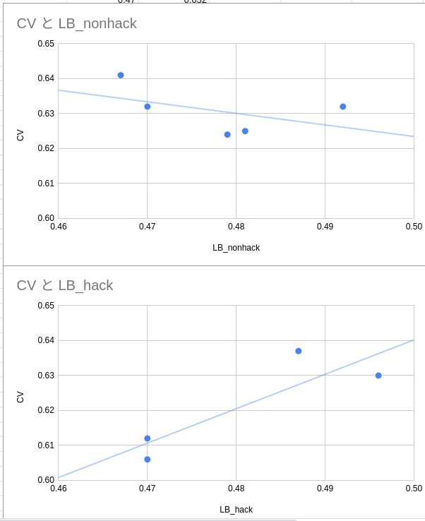

# student cup 2020

https://signate.jp/competitions/281

## Member

- chizuchizu
- shion fujito

## Model

### simple transformer

- BERT
- RoBERTa

### regression

1~4のラベルを順序尺度としてみる。全通りの並び替えで学習させた。24モデル。

- LGBM

### stacking

- LGBM

### Features

- TF-IDF, Count VectorをSVDで次元削除
- KMeans

##### augment

英語→外国語→英語　　を3カ国語（日本、ドイツ、フランス）で行った。

trainデータとtestデータどちらもこの処理を行ったのでモデルは 16倍になり、stackingでも少し精度が上がった。

### CV vs LB

LBの分布のハックについてはこちらから→→https://signate.jp/competitions/281/discussions/20200816040343-8180

普通に提出するnon_hackのほうだと全然相関取れないのでTrust CVしました。最高スコアはLBが0.467だったのでかなり低いです。

### What didn't  works

#### LSTM

https://www.kaggle.com/sakami/single-lstm-3rd-place　より

- GRU
- Pooling
- embedding
- dropout

optimizer：scale_cos

出力はepochごとの指数重み付け平均。また、重みのEMAでも出力した。

#### Pseudo Labeling

単純にF1スコアが低い当てづらい指標だったからだと思う。閾値をとることで自信のある予測だけ取ろうとしたけどそれもうまくいかなかった。

#### Transformers

- BERT-large
- xlnet
- ALBERT
- BART

データが軽くて重いモデルだとあんまりフィットしない感じがした。ALBERTが効かなかったのは意外だったけどBERTが安定していた。

